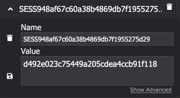

# Grade Getter

**Ts pulls your grades straight from Schoology, no clicking around, no API access required .**

I hate schoology sm its so slow and the UI is soo outdated, slow, and their servers are stright ass.

---
# I AM PUTTING OFF UPDATING THIS README UNTIL THE BIG API CHANGE FOR THIS. Stay tuned
## How to Run It

### 1. Grab your session token

Slide into your browser's dev tools -> cookies -> copy your `SESS9xxxx...` token.  


_(dont leak it bruh)_

Have it formated like so "<ins>SESS9</ins>XXXXXXXXXXXXXXXXXXXXXXXXXXXXXXXX=BXXXXXXXXXXXXXXXXXXXXXXXXXXXXXXX"

make sure to find the SESS9 cuz there are multiple session cookies /\

> have it formated like this, NAME=VALUE

### 2. Run the code:

```bash
cargo run --release -- your_token_here
```

### What This Does

* Pulls grading period tokens

* Selects the grading quarter (Q1–Q4)

* Grabs your classes + final grades

* Parses the grades into clean JSON

* Saves the raw HTML in index.html just in case

### Function Rundown

| Function                      | funtion description                                               |
| ----------------------------- | ----------------------------------------------------------------- |
| `fetch_export_form_tokens()`  | Grabs the form tokens/build_id Schoology finna gonna hide         |
| `select_grade_period()`       | Picks the grading quarter (change the IDs)                        |
| `fetch_final_grades_export()` | Pulls that grade HTML after selecting your classes                |
| `parse_grades_html()`         | Parses the mess into a usable `HashMap<String, Vec<Option<f32>>>` |

### OUTPUT (ignore my bad social studdies grade i was looking at the damn rust book in class)

```bash
[devin@gentoo-vm rusty]$ ./target/release/gradegetter  SESS9XXXXXXXXXXXXXXXXXXXXXXXXXXXXXXX=XXXXXXXXXXXXXXXXXXXXXXXXXXXXXXXX
{
  "Freshmen Seminar": [
    89.0,
    93.2,
    93.0,
    76.75
  ],
  "Spanish I CP": [
    93.15,
    80.19,
    94.86,
    91.0
  ],
  "Geometry Honors": [
    95.08,
    89.56,
    90.24,
    80.1
  ],
  "World History Honors": [
    75.8,
    62.13,
    82.82,
    68.75
  ],
  "Biology I Honors": [
    87.41,
    83.96,
    93.13,
    96.01
  ],
  "English 9 Honors": [
    88.0,
    77.0,
    88.0,
    81.0
  ]
}
```

### NOTES

1. tweeking required (for the requests URL)
2. oh yeah TWEAK EVERYTHING 😭
3. tweak the values for classes and grading periods but lowk im too tired rn so i wont show u how to do it...sorry
4. Any issues? hmu on the issues tab
